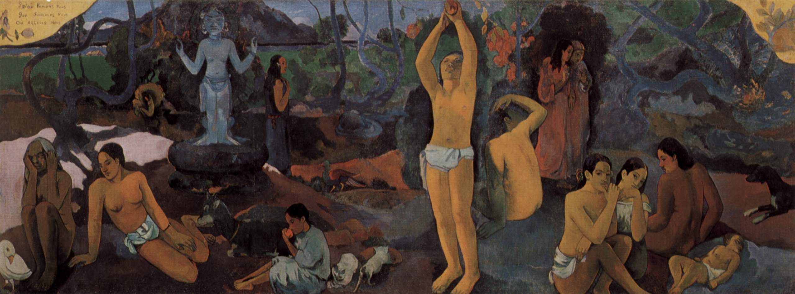
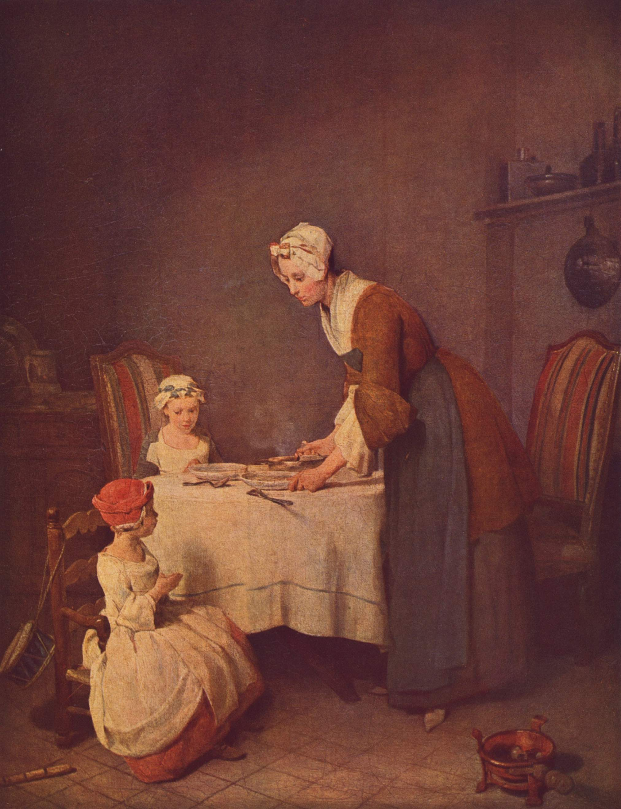
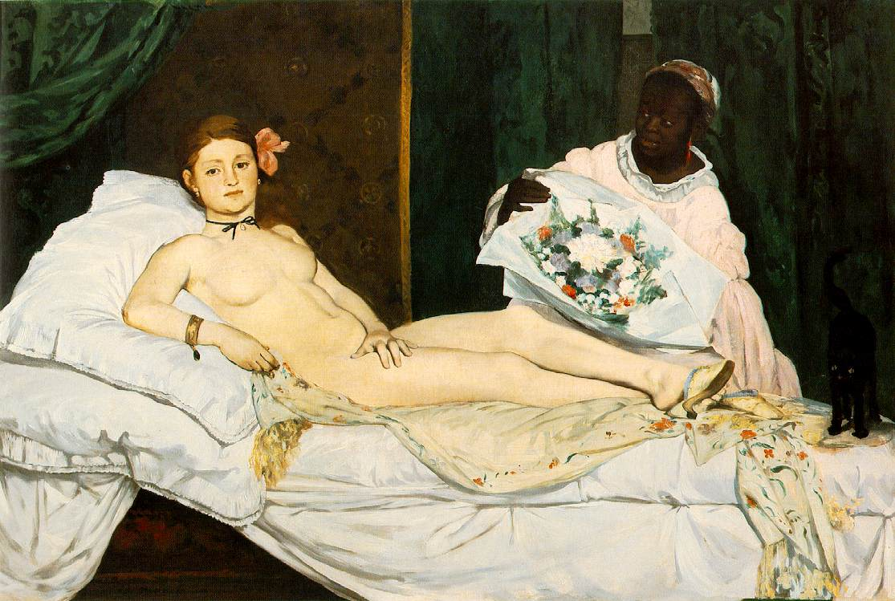
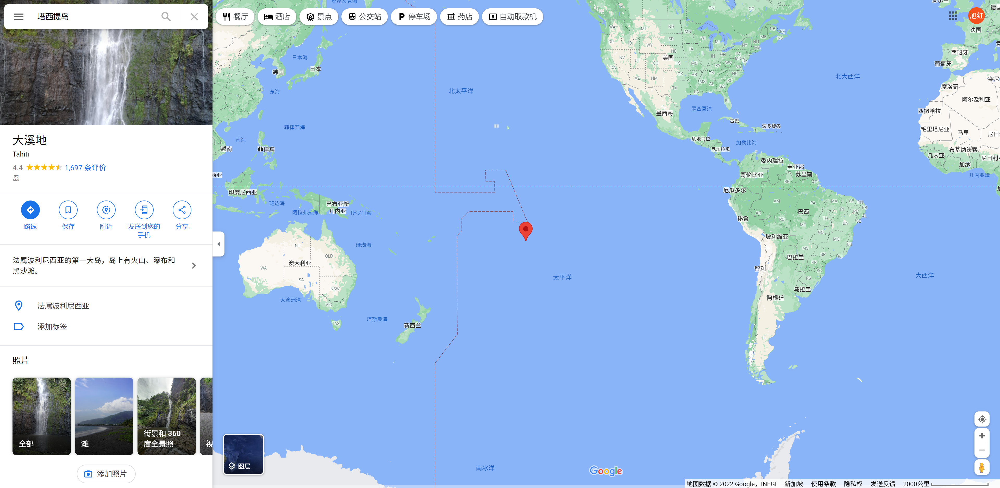
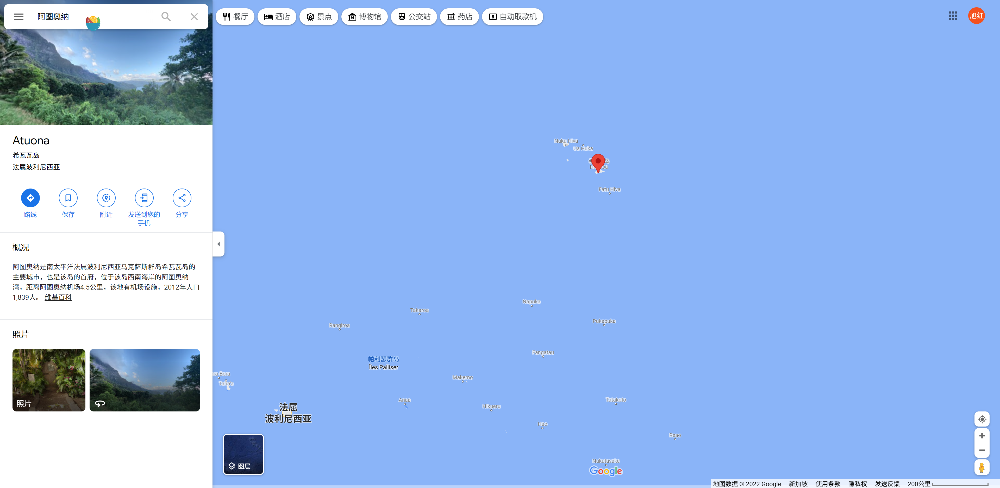
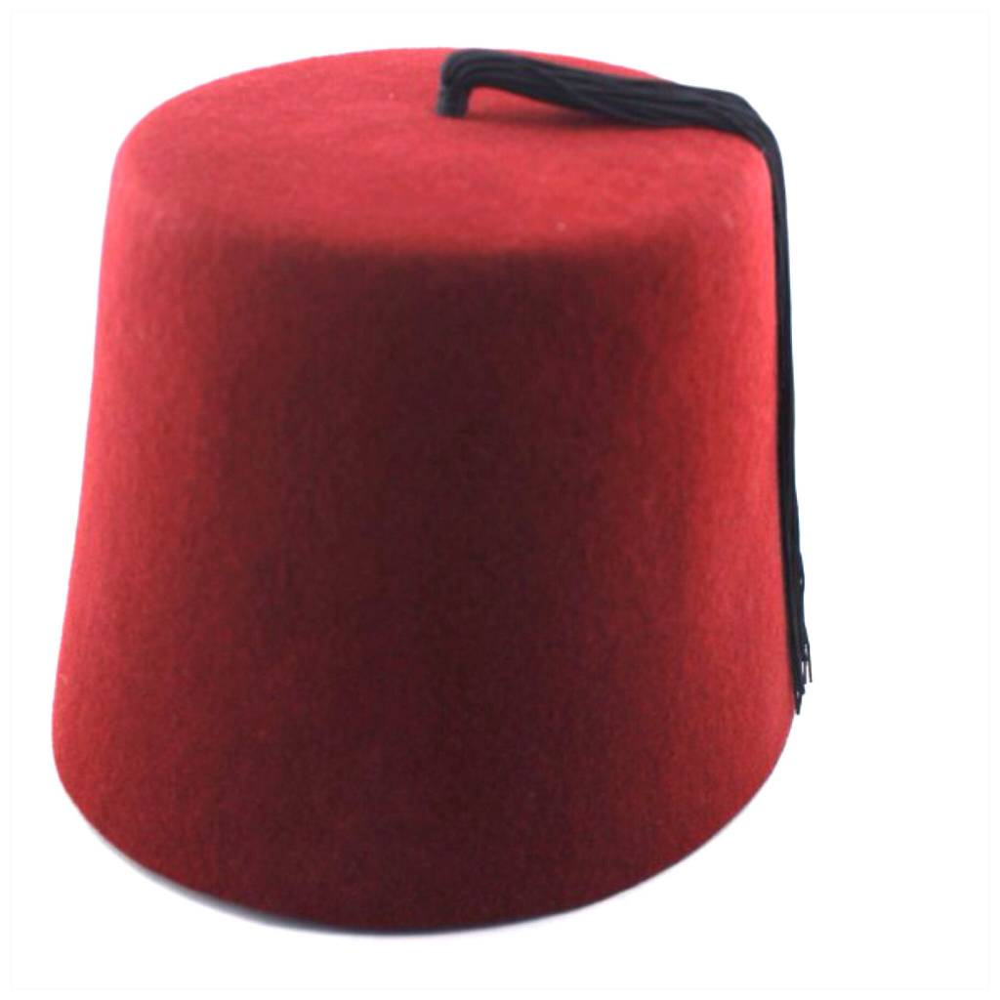
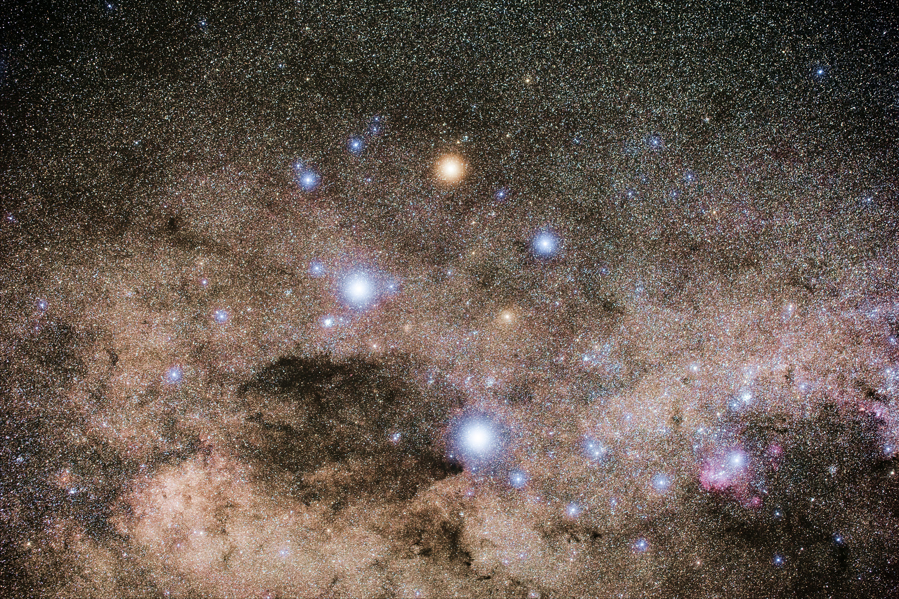

### 《月亮与六便士》
* 作者：毛姆（英国）
* 译者：苏忠福
* 出版社：时代文艺出版社
* 版次：2017年9月第一版

人们把面具佩戴得天衣无缝，连他们自己都以为在戴面具的过程中自己实际上成了和面具一样的人了。--引自自全书

他们认为艺术只是一种才艺，只有手艺人才真正理解，这是一种奇谈怪论：艺术是感情的表露，感情讲一种芸芸大众都能听懂的语言。--引自003页

我忘记谁建议过，为了让灵魂受益，每天应该做两件自己不喜欢的事情。--引自008页

我从写作中汲取的教训是，作者应该从创作的乐趣中得到报酬，从思想负担的释放中得到回报：对其他东西都不必介意，表扬还是苛评、失败还是成功，都应该坦然面对。--引自009页

我告诉你我得画画。我管不住自己。一个人掉进水里，他以何种姿势游泳是无关紧要的，游得好坏都无所谓：他不得不挣扎出来，别让自己淹死才是大事。--引自054页

只有诗人或者圣贤才会坚信，在沥青路面上浇水，百合花会长出来回报他得辛勤付出。--引自056页

我没有认识到，一个人的性格会如此复杂。我现在很清楚，同一个人的内心，你可以发现卑鄙和伟大、恶毒和慈悲、仇恨和慈爱，它们并行不悖。--引自067页

苦难能让性格高贵，这话不准确：幸福有时候倒有这种作用，但是苦难，多数情况下，只能让人变成宵小，心生报复。--引自072页

为什么你会认为美，这一世界上最宝贵的东西，能像石头一样被仍在沙滩上，让一个漫不经心的过路人随便捡起来？美是奇妙的东西、奇怪的东西，画家经过折磨灵魂才能从这混沌的乱世中将它找出来。画家把美创造出来，美可不是所有人都能辨认出来的。你要想认出美来，就必须重复画家的那种冒险。他唱给你听的是一曲优美的旋律，你自己内心要再次聆听它，你就需要知识、敏感性和想象力。--引自083页

我的生活就是努力干活，不做什么拈花惹草的事情；这个方向尝试一下，那个方向找点经历；一步一步获得一些书本知识和人情世故。--引自087页

我不相信斯克里克兰德和布兰奇斯特罗伊夫坠入了爱河。我不相信他能爱上什么人。爱情是一种感情，慈悲是其中德基本成分，但是斯特里克兰德对人对己都没有慈悲。爱情有一种软弱的专义，有一种保护的愿望，热衷于做善事，给人以快活——如果算不上无私，那么无论如何也是一种千方百计掩藏起来的自私。爱情有一种羞怯。我看斯特里克兰德身上没有这些品质。爱情是引人入胜的；爱情要把施爱的人从自身剥离出来；最聪明的，哪怕他分明知道，却不能在实践中认识到爱情会停止；爱情很清楚自身是虚幻的，却赋予具象，而且，又很清楚自身什么东西都不是，却爱过它胜过爱真实。爱情让一个人膨胀了很多，同时又让人缩小了不少。他不再是他自己了。他不再是个体的人，而是一种东西、一种工具，去追求某种与自我格格不入的目的。--引自131页

女人对深爱她而自己又不爱的男人异常残酷，世上没有比这更狠的残酷了。这时她没有善良，甚至连容忍也没有，只有一点就着的火气。--引自132页

一个人的外表有时候很难与他的灵魂保持一致，这实在是难为人。德克斯特罗衣夫内心具有罗密欧式的激情，却生就一副托比倍尔契式的相貌；他具备仁慈和宽厚的本质，却总是把事情搞砸了；他能真正领略到美德东西，但这种本领一旦付诸实践却只能创造出平庸德物件；他有特别细腻德感情，外表却粗俗不堪；他处理别人的事情头头是道，轮到自己的事情则一塌糊涂。造化在创造这种人时，把许多矛盾的元素都捏在了一起，让他直面这大千世界的令人迷惑的冷酷无情，这是开了一个多么残忍的捉弄人的玩笑啊。--引自134页

他好像一个神秘家，一心要描述那种不可言表的东西。不过，一个事实我还是听出来了：人们动不动就爱谈论美，其实遣词造句没有感觉，他们把“美”这个词儿用得漫不经心，因此美就失去了力量；美代表的那种东西，用了美这个带上了成百种碎小的物体的名字，反而把它的尊严剥夺了。他们把一件衣服、一只狗、一篇布道都用美来形容；当他们与美面对面时，倒是不能分辨出来了。他们力图把他们毫无价值的思想进行虚假的强调，反让他们的感情变得呆钝起来。如同江湖骗子有时感觉到自己是在伪造一种精神力量一样，人们丧失了他们滥用的能量。
然后，斯特罗伊夫，这个不可征服的滑稽角色，却热爱美、理解美，因为美如同他自己的真挚的诚实的灵魂，是真挚的、诚实的。在他看来，美就是信仰者心中的上帝。一旦他看见了美，他就会产生敬畏之心。--引自158页

也许，我们没有意识到，因为我们希望别人尊重我们的意见，所以倍加珍惜自己可以影响别人的力量，我们不喜欢那些自己无法影响的人。我以为这才是人类自尊的最溃烂的伤口。--引自170页（这段话前面有一大段斯特里克兰德关于爱情的表述，有点极端，但不失为一种角度，考虑到会有所不适就不摘录了。）

一个人的作品最能反应他是什么样的人。在人与人交往中，人们只会让你看到他希望你看到的一些表面现象，你只有通过参考他无意识中的一些小动作才能真正地了解他，因为那些小动作是无意识的，还有那些他脸上稍纵即逝的表情。
有时候，人们把面具佩戴得天衣无缝，连他们自己都以为在佩戴面具的过程中自己实际上就成了和面具一样的人了。--引自172页

我们每个人在这世界上都是孤独的，每个人被禁锢在一座铜塔里，只能通过符号与我们的同胞交流，可这些符号没有共同价值的，因为它们的意义是模糊的、不确定的。我们设法把我们心里的珠宝转送给别人，求他们慈悲为怀，但是他们却没有能力接受它们，于是我们只好孤独地前行，肩并肩走而不能一起走，无法了解我们的同胞，同胞也无法了解我们。我们好比那些生活在另一个国家的人，他们对自己的语言掌握得少而又少，他们具备可以用言语表达出的美丽而深刻的东西的所有风格，却只能用会话手册的陈词滥调进行交流。他们脑子里的观念塞得满满的可他们只能告诉你园丁姨妈的雨伞在屋子里。--引自175页

他把苦苦挣扎的秘密留给自己。如果他曾在画室里单枪匹马和上帝的天使孤注一掷地扭打在一起，那他从来没有让任何人窥见他鼻青脸肿的样子。--引自180页

蒂亚蕾——她父亲给她取这个名字，是一种白色的香花，人们说，如果你闻过一次，你最终就会被吸引到塔西提岛，不管你浪迹何处——蒂亚蕾对斯特里克兰德的事情记忆犹新。--引自209页

我认为，有些人生来就生错了地方。偶然事件把他们抛进了特定环境中，但是他们总是怀有一种连他们自己也不清楚的乡愁。他们在他们的出生地是陌生人，而他们孩提时代就熟悉的绿树成荫的小巷或者玩耍过的熙熙攘攘的街道，也不过是他们人生旅途的一站。他们与自己的亲朋交往一辈子也形同陌路，在他们唯一熟悉的场景中落落寡合。也许就是这种陌生感，让人选择远走他乡，漂流四方，寻找某些永久性的东西，让他们可以牢牢地依附在上面。也许某种根深蒂固的返祖诉求，督促这种彷徨者回到他祖先在历史的懵懂混沌时代离开的故土。
有时，一个人偶然来到一个地方，他莫名其妙地感觉自己属于这里。这里就是他苦苦寻求地故乡，他愿意在他从来没有见识过地环境里安居下来，仿佛这种环境是他们生来就熟悉的。他最后会在这里寻找到宁静。--引自211页

你知道，当一个人坠入情网时，他们对世上的什么事情都听不到、看不见了。这时候他们就像在木船的坐板上的奴隶一样。把斯特里克兰德紧紧抓住的那种激情，和爱情一样。一点儿松动的缝隙都不会有的。
紧紧抓住斯特里克兰德的那种激情，是可以创造美的激情。那种激情不会让他平静。它催促他，逼迫他，让他满世界乱走。他这一辈子就是一个上路的香客，附在他身上的那个魔鬼是铁石心肠。有些人渴望真理的劲头太大，他们为了求得真理，最后返会把他们世界的根据动摇了。斯特里克兰德就是这种情况，只是他追求的是美，而不是真理。我只会对他怀有深深的同情。
--引自229页

### 书中提到的好玩的东西
* 酒类
    * 苦艾酒 
    * 圣加尔米尔葡萄酒
    * 加拿大克拉伯威士忌

* 画
    * 高更
        * 《我们从何处来？我们是谁？我们向何处去？》
        
    * 夏尔丹
        * 《饭前祈祷》
        
    * 马奈
        * 《奥林匹亚》
        
        * 《草地上的午餐》
        
        
* 谚语
    * you must lie on the bed that you have made可翻译为“自作自受”，“自己刨坑自己埋”

    * have other fish to fry
    可翻译为“有别的事情要做”，“没有多余的工夫浪费”

* 塔西提岛
    

    * 阿图奥纳
    

* 帽子
    * 塔布什帽-土耳其
    

* 南十字星:南十字座（英语：Crux，发音： /ˈkrʌks/）或称十字架座，位于半人马座和苍蝇座之间，是全天88个星座中最小，但有特色的一个。它的英文名称源自拉丁文的十字，它的造型就以十字形为主，在 **北回归线以南** 的地方皆可看到整个星座，因此被称为南十字，以与北十字（天鹅座的中心部分）有所区别。

